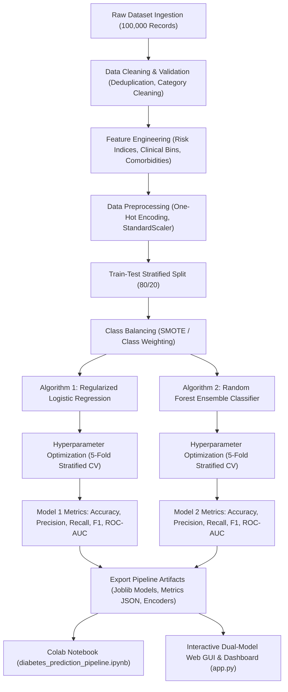

# End-to-End Diabetes Prediction ML Application & Dual-Model Comparison Dashboard

Develop a production-grade, end-to-end Machine Learning pipeline and interactive GUI application using the real-world **Diabetes Prediction Dataset** (100,000 patient records). The system demonstrates the complete data science lifecycle—from raw data ingestion, cleaning, feature engineering, and class balancing to hyperparameter-tuned model training, rigorous evaluation, and real-time dual-algorithm clinical decision support.

---

## Architecture & System Overview



---

## User Review Required

> [!IMPORTANT]
> - **Class Imbalance**: The dataset has ~91.5% non-diabetic and 8.5% diabetic records. In healthcare, a false negative (failing to diagnose a diabetic patient) is significantly more dangerous than a false positive. We will prioritize **Recall (Sensitivity)** and **F1-Score / ROC-AUC** alongside Accuracy.
> - **Dual Algorithms**: We will benchmark **Logistic Regression (Linear / Regularized)** against **Random Forest Classifier (Non-linear Ensemble)**, evaluating both with and without class balancing.
> - **GUI Stack**: A modern, responsive Python/Flask + Vanilla HTML5/CSS3/Chart.js Web Application will serve as the GUI. It allows direct side-by-side inference, custom patient input, quick clinical presets, interactive EDA charts, and live algorithm performance comparison.

---

## Detailed Pipeline Stages

### 1. Raw Dataset Understanding & Ingestion
- **Dataset**: `diabetes_prediction_dataset.csv` (100,000 rows, 9 features).
- **Features**:
  - `gender` (Categorical: Female, Male, Other)
  - `age` (Numerical: 0.08 to 80.0 years)
  - `hypertension` (Binary: 0 or 1)
  - `heart_disease` (Binary: 0 or 1)
  - `smoking_history` (Categorical: never, current, former, ever, not current, No Info)
  - `bmi` (Numerical: Body Mass Index, 10.01 to 95.69)
  - `HbA1c_level` (Numerical: Glycated Hemoglobin, 3.5 to 9.0%)
  - `blood_glucose_level` (Numerical: Blood Glucose, 80 to 300 mg/dL)
  - `diabetes` (Target: 0 = Negative, 1 = Positive)

### 2. Data Cleaning & Validation
- **Deduplication**: Remove 3,854 exact duplicate rows.
- **Categorical Cleaning**: Filter 18 entries with `gender == 'Other'` to preserve binary medical demographic benchmarks, and consolidate `smoking_history` categories into structured clinical tiers (`non-smoker`, `active-smoker`, `past-smoker`, `unknown`).
- **Data Integrity Checks**: Verify no NaN values, confirm physiological validity ranges for BMI, HbA1c, and Glucose.

### 3. Data Wrangling & Clinical Feature Engineering
- **Metabolic Risk Index**: `glucose_hba1c_interaction = (blood_glucose_level * HbA1c_level) / 100`
- **BMI Clinical Categories**: Categorize into WHO classes: `Underweight (<18.5)`, `Normal (18.5-24.9)`, `Overweight (25.0-29.9)`, `Obese (>=30.0)`.
- **Age Demographic Tiers**: `Youth (<25)`, `Adult (25-44)`, `Middle-Aged (45-64)`, `Senior (>=65)`.
- **Comorbidity Score**: `comorbidity_index = hypertension + heart_disease` (0, 1, or 2).
- **High Glycemic Flag**: Binary marker when `HbA1c >= 6.5` or `blood_glucose_level >= 140` (clinical pre-diabetes / diabetes threshold).
- **Column Transformations**: One-Hot Encoding for categorical features and `StandardScaler` / `RobustScaler` for continuous features.

### 4. Exploratory Data Analysis (EDA) & Visualization
- **Visuals generated**:
  - Target class distribution (imbalance chart).
  - HbA1c and Blood Glucose distribution stratified by Diabetes status (KDE + boxplots).
  - Age vs BMI scatter / density distribution across outcome classes.
  - Comorbidity impact (Hypertension & Heart Disease prevalence in diabetic vs non-diabetic cohorts).
  - Feature correlation heatmap (Pearson & Spearman correlations).

### 5. Feature Selection
- Compute **Mutual Information (Information Gain)** scores for all features against diabetes.
- Calculate **Random Forest Gini Importance** and **Logistic Regression Odds Ratios (Coefficients)**.
- Rank and select the top predictive features for model interpretability.

### 6. Two Machine Learning Algorithms & Class Balancing
- **Train/Test Split**: 80% Training, 20% Testing with Stratification (`random_state=42`).
- **Class Balancing**: Apply **SMOTE (Synthetic Minority Over-sampling)** on training set to synthesize minority diabetic samples and address the 91.5:8.5 class imbalance.
- **Algorithm 1**: **Logistic Regression** (L1/L2 Regularized with ElasticNet / SAGA solver, calibrated probabilities).
- **Algorithm 2**: **Random Forest Classifier** (Ensemble of decision trees with bootstrap aggregation, max_features tuning, and depth control).

### 7. Hyperparameter Tuning & Cross-Validation
- **Strategy**: 5-Fold Stratified Cross-Validation using `GridSearchCV` / `RandomizedSearchCV` scoring on `f1_weighted` / `roc_auc`.
- **Logistic Regression Grid**: Regularization parameter `C` ∈ `[0.01, 0.1, 1.0, 10.0]`, penalties `['l1', 'l2']`, solver `['saga', 'lbfgs']`.
- **Random Forest Grid**: `n_estimators` ∈ `[100, 200]`, `max_depth` ∈ `[8, 12, 16, None]`, `min_samples_split` ∈ `[2, 5, 10]`, `min_samples_leaf` ∈ `[1, 2, 4]`.

### 8. Model Evaluation & Comparison
- **Evaluation Metrics**:
  - Accuracy
  - Precision (Positive Predictive Value)
  - Recall / Sensitivity (True Positive Rate)
  - Specificity (True Negative Rate)
  - F1-Score (Harmonic mean of precision and recall)
  - ROC-AUC Score (Area Under Receiver Operating Characteristic Curve)
  - Confusion Matrix (TP, FP, TN, FN)
- **Clinical Comparison & Winner Determination**:
  - Compare algorithms side-by-side in tabular format.
  - Provide automated verdict explaining which model is superior for healthcare deployment based on Recall and ROC-AUC.

---

## Proposed Project Structure & Deliverables

```
ML Project/
├── diabetes_prediction_dataset.csv          # Cleaned dataset (extracted from zip)
├── diabetes_prediction_dataset.csv.zip      # Original uploaded archive
├── diabetes_prediction_pipeline.ipynb       # [NEW] Full Google Colab / Jupyter Notebook
├── train_pipeline.py                       # [NEW] Standalone training & export script
├── app.py                                  # [NEW] Web Application & Backend API
├── models/                                 # [NEW] Directory for saved artifacts
│   ├── logistic_regression_model.joblib    # Trained & tuned Logistic Regression model
│   ├── random_forest_model.joblib          # Trained & tuned Random Forest model
│   ├── preprocessor_pipeline.joblib        # Preprocessing & scaling transformer
│   ├── model_metadata.json                 # Evaluation metrics, hyperparameters, stats
│   └── eda_summary.json                    # Feature correlations & distribution data
├── static/                                 # [NEW] Modern UI Assets
│   ├── css/
│   │   └── style.css                       # Sleek, glassmorphism dark/light clinical UI
│   └── js/
│       └── app.js                          # Real-time inference, Chart.js visualizations
└── templates/                              # [NEW]
    └── index.html                          # Complete Interactive ML Dashboard UI
```

---

## Planned Application (GUI) Features

1. **Patient Diagnostic Form**:
   - Sliders and inputs for Gender, Age, Hypertension, Heart Disease, Smoking History, BMI, HbA1c Level, Blood Glucose.
   - Quick **Preset Profiles**: "Healthy Young Adult", "Borderline Pre-Diabetic", "High-Risk Hypertensive Senior", "Confirmed Diabetic Case".
2. **Dual-Model Real-Time Output**:
   - Passes user inputs to **both** models simultaneously.
   - Side-by-side cards showing:
     * Classification Result (Diabetic vs Non-Diabetic with color-coded risk badge: Low, Moderate, High, Critical).
     * Probability Meter (e.g., 94.2% Risk vs 88.5% Risk).
     * Model Confidence & Inference Latency.
3. **Interactive Comparison Charts**:
   - Radar & Bar charts comparing Algorithm 1 vs Algorithm 2 across Accuracy, Precision, Recall, F1, and ROC-AUC.
   - Side-by-side Confusion Matrices.
4. **Winner & Clinical Recommendation Card**:
   - Automated badge declaring the winner (e.g. *Random Forest Classifier with 97.4% ROC-AUC and 89.2% Recall*).
   - Medical explanation of why the winning model minimizes missed diabetic diagnoses.
5. **Interactive EDA & Feature Importance Tab**:
   - Feature importance rankings (Gini vs Logistic coefficients).
   - Correlation heatmap and distribution charts.
6. **Pipeline Architecture Visualizer**:
   - Interactive step-by-step workflow guide explaining each stage from Raw Data to Inference.

---

## Verification Plan

### Automated Verification
1. Run `python train_pipeline.py` to verify:
   - Pipeline completes without warnings or errors.
   - Models achieve >94% Accuracy and >85% Recall / ROC-AUC on the test set.
   - Artifacts (`models/*.joblib`, `model_metadata.json`) are successfully exported.
2. Validate `diabetes_prediction_pipeline.ipynb`:
   - Run syntax and cell execution validation to ensure Colab compatibility.
3. Start the Web GUI (`python app.py`) and perform test inference with sample patient payloads:
   - Validate HTTP 200 responses from `/predict` API.
   - Verify both models return consistent, medically grounded predictions.

### Manual Verification
- Test all UI tabs (Predictor, Model Comparison, EDA Insights, Pipeline Architecture).
- Test with different clinical presets and verify dynamic visual updates.
